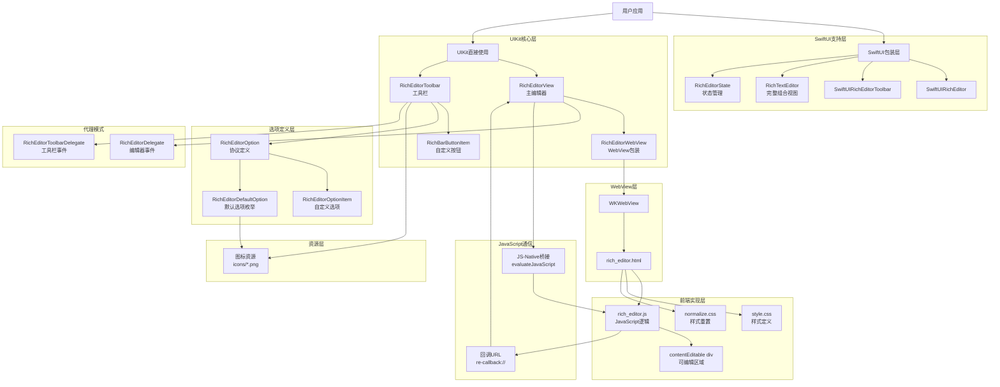

# RichEditorView 项目架构与学习指南

> 一个功能完整的iOS富文本编辑器框架，采用混合架构设计，同时支持UIKit和SwiftUI

## 📋 目录

- [项目架构](#-项目架构)
- [学习路径](#-源码学习路径)
- [核心特性](#️-核心特性) 
- [设计优势](#-设计优势)
- [快速开始](#-快速开始)

## 🏗️ 项目架构



### 架构层次说明

#### 1. **用户接口层**
- 支持 **UIKit** 和 **SwiftUI** 两种使用方式
- 提供灵活的集成选择

#### 2. **SwiftUI包装层**
- `SwiftUIRichEditor`: SwiftUI版本的编辑器包装器
- `SwiftUIRichEditorToolbar`: SwiftUI版本的工具栏包装器  
- `RichTextEditor`: 包含编辑器+工具栏的完整组合视图
- `RichEditorState`: 用于状态管理的ObservableObject

#### 3. **UIKit核心层**
- `RichEditorView`: 核心编辑器组件，继承自UIView
- `RichEditorToolbar`: 可滚动的工具栏，包含各种编辑操作按钮
- `RichEditorWebView`: WKWebView的简单包装器

#### 4. **前端实现层**
- `rich_editor.html`: 基础HTML结构，包含可编辑的div
- `rich_editor.js`: JavaScript逻辑，实现所有富文本编辑功能
- `style.css + normalize.css`: 样式定义和浏览器兼容性

### 🔄 关键工作原理

#### JavaScript-Native通信机制
1. **Swift → JavaScript**: 通过`webView.evaluateJavaScript()`调用JS函数
2. **JavaScript → Swift**: 通过回调URL (`re-callback://`) 触发Swift代理方法
3. **命令队列**: JS将多个操作打包成JSON命令队列，Swift批量处理

#### 代理模式
- `RichEditorDelegate`: 处理编辑器事件（内容变化、焦点变化、高度变化）
- `RichEditorToolbarDelegate`: 处理需要原生UI的操作（颜色选择、图片插入）

## 📚 源码学习路径

推荐按以下顺序循序渐进地学习源码：

### **第一步：理解协议定义和选项系统** ⭐️ 最佳起点

**文件：`Sources/RichEditorOptionItem.swift`**

这是最佳起点，定义了整个项目的核心概念：

```swift
// 理解这三个关键概念：
1. RichEditorOption 协议 - 定义工具栏选项的接口
2. RichEditorOptionItem 结构体 - 自定义选项的实现  
3. RichEditorDefaultOption 枚举 - 所有预设的编辑功能
```

**为什么从这里开始？**
- 📋 定义了所有可用的编辑功能（粗体、斜体、列表等）
- 🎯 理解了选项系统就能理解整个工具栏的工作原理
- 🔧 看懂了枚举的 `action()` 方法就知道每个功能如何调用

### **第二步：理解WebView包装器**

**文件：`Sources/RichEditorWebView.swift`**

这个文件很简单（只有24行），但很重要：
- 🎛️ 自定义了 `inputAccessoryView` 属性
- 🔧 为后续的键盘工具栏功能做准备

### **第三步：深入核心编辑器实现** 🎯 重点！

**文件：`Sources/RichEditorView.swift`**

这是整个项目的核心（913行），建议分段学习：

```swift
// 学习顺序：
1. 先看协议定义 (RichEditorDelegate)
2. 再看基本属性和初始化
3. 理解JavaScript通信机制 (runJS 方法)
4. 学习各种编辑方法 (bold, italic, etc.)
5. 最后看代理方法和事件处理
```

### **第四步：学习工具栏实现**

**文件：`Sources/RichEditorToolbar.swift`**

理解工具栏如何：
- 📱 显示按钮和处理滚动
- 🔗 与编辑器通信
- 🎨 处理复杂操作（颜色选择等）

### **第五步：理解前端实现**

**文件：**
- `Sources/Resources/editor/rich_editor.html` - HTML结构
- `Sources/Resources/editor/rich_editor.js` - JavaScript逻辑

理解：
- 💻 contentEditable 如何工作
- 🌉 JavaScript-Swift 通信桥接
- ⚡ 命令队列机制

### **第六步：学习SwiftUI包装层**

**文件：`Sources/SwiftUIRichEditor.swift`**

理解如何：
- 🔄 将UIKit组件包装为SwiftUI
- 📊 使用 Coordinator 模式处理代理
- 🎛️ 管理状态和数据绑定

## 🛠️ 核心特性

- ✅ 支持所有标准富文本格式（粗体、斜体、下划线等）
- ✅ 支持标题、列表、对齐、缩进
- ✅ 支持颜色、图片、链接插入
- ✅ 撤销/重做功能
- ✅ 自适应高度
- ✅ 键盘工具栏支持
- ✅ 暗黑模式支持
- ✅ SwiftUI和UIKit双重支持

## 🎯 设计优势

### 1. **混合架构**
- 利用Web技术的富文本编辑能力
- 保持原生iOS的性能和集成度

### 2. **双框架支持**  
- 同时支持UIKit和SwiftUI
- 适应不同项目需求

### 3. **高度可定制**
- 通过协议和代理模式支持自定义操作
- 灵活的UI定制选项

### 4. **资源管理**
- 图标和前端文件都内嵌在框架中
- 开箱即用，无需额外配置

## 🚀 快速开始

### UIKit 使用方式

```swift
import UIKit

class ViewController: UIViewController {
    @IBOutlet var editorView: RichEditorView!
    @IBOutlet var toolbar: RichEditorToolbar!
    
    override func viewDidLoad() {
        super.viewDidLoad()
        
        // 设置编辑器
        editorView.delegate = self
        editorView.placeholder = "请输入内容..."
        
        // 设置工具栏
        toolbar.editor = editorView
        toolbar.options = RichEditorDefaultOption.all
    }
}

extension ViewController: RichEditorDelegate {
    func richEditor(_ editor: RichEditorView, contentDidChange content: String) {
        print("内容变化: \(content)")
    }
}
```

### SwiftUI 使用方式

```swift
import SwiftUI

struct ContentView: View {
    @State private var htmlContent = ""
    
    var body: some View {
        RichTextEditor(
            htmlContent: $htmlContent,
            placeholder: "请输入内容...",
            onContentChange: { content in
                print("内容变化: \(content)")
            }
        )
    }
}
```

## 📝 主要组件说明

### RichEditorView
核心编辑器组件，提供所有富文本编辑功能。

### RichEditorToolbar  
可滚动的工具栏，包含各种格式化选项。

### RichEditorDefaultOption
预定义的编辑选项枚举，包含所有常用功能。

### SwiftUI 包装器
- `SwiftUIRichEditor`: SwiftUI编辑器
- `SwiftUIRichEditorToolbar`: SwiftUI工具栏
- `RichTextEditor`: 完整的组合视图

---

## 📖 更多信息

这个项目是一个设计良好的富文本编辑器框架，通过分层架构实现了功能丰富、易于集成的解决方案。

建议按照上述学习路径逐步深入理解各个组件，这样能够更好地掌握整个框架的设计思想和实现细节。
RichEditorView 项目架构分析
这个项目是一个功能完整的iOS富文本编辑器框架，采用了混合架构设计。以下是各个层次的详细说明：
🏗️ 架构层次
1. 用户接口层
支持 UIKit 和 SwiftUI 两种使用方式
提供灵活的集成选择
2. SwiftUI包装层
SwiftUIRichEditor: SwiftUI版本的编辑器包装器
SwiftUIRichEditorToolbar: SwiftUI版本的工具栏包装器
RichTextEditor: 包含编辑器+工具栏的完整组合视图
RichEditorState: 用于状态管理的ObservableObject
3. UIKit核心层
RichEditorView: 核心编辑器组件，继承自UIView
RichEditorToolbar: 可滚动的工具栏，包含各种编辑操作按钮
RichEditorWebView: WKWebView的简单包装器
4. 前端实现层
rich_editor.html: 基础HTML结构，包含可编辑的div
rich_editor.js: JavaScript逻辑，实现所有富文本编辑功能
style.css + normalize.css: 样式定义和浏览器兼容性
🔄 关键工作原理
JavaScript-Native通信机制:
Swift → JavaScript: 通过webView.evaluateJavaScript()调用JS函数
JavaScript → Swift: 通过回调URL (re-callback://) 触发Swift代理方法
命令队列: JS将多个操作打包成JSON命令队列，Swift批量处理
代理模式:
RichEditorDelegate: 处理编辑器事件（内容变化、焦点变化、高度变化）
RichEditorToolbarDelegate: 处理需要原生UI的操作（颜色选择、图片插入）
🛠️ 主要特性
✅ 支持所有标准富文本格式（粗体、斜体、下划线等）
✅ 支持标题、列表、对齐、缩进
✅ 支持颜色、图片、链接插入
✅ 撤销/重做功能
✅ 自适应高度
✅ 键盘工具栏支持
✅ 暗黑模式支持
✅ SwiftUI和UIKit双重支持
🎯 设计优势
混合架构: 利用Web技术的富文本编辑能力 + 原生iOS的性能和集成度
双框架支持: 同时支持UIKit和SwiftUI，适应不同项目需求
高度可定制: 通过协议和代理模式，支持自定义操作和UI
资源管理: 图标和前端文件都内嵌在框架中，使用方便
这个项目是一个设计良好的富文本编辑器框架，通过分层架构实现了功能丰富、易于集成的解决方案。
我要从哪里开始看源码，学习这个项目

根据我对项目架构的分析，我为您推荐一个循序渐进的源码学习路径：
学习协议定义和选项系统 (RichEditorOptionItem.swift)
📚 源码学习路径推荐
第一步：理解协议定义和选项系统 ⭐️ 从这里开始！
文件：Sources/RichEditorOptionItem.swift
这是最佳起点，因为它定义了整个项目的核心概念：
所有预设的编辑功能
为什么从这里开始？
📋 定义了所有可用的编辑功能（粗体、斜体、列表等）
🎯 理解了选项系统就能理解整个工具栏的工作原理
🔧 看懂了枚举的 action() 方法就知道每个功能如何调用
第二步：理解WebView包装器
文件：Sources/RichEditorWebView.swift （您现在正在看的文件）
这个文件很简单（只有24行），但很重要：
🎛️ 自定义了 inputAccessoryView 属性
🔧 为后续的键盘工具栏功能做准备
第三步：深入核心编辑器实现 🎯 重点！
文件：Sources/RichEditorView.swift
这是整个项目的核心（913行），建议分段学习：
最后看代理方法和事件处理
第四步：学习工具栏实现
文件：Sources/RichEditorToolbar.swift
理解工具栏如何：
📱 显示按钮和处理滚动
🔗 与编辑器通信
🎨 处理复杂操作（颜色选择等）
第五步：理解前端实现
文件：
Sources/Resources/editor/rich_editor.html - HTML结构
Sources/Resources/editor/rich_editor.js - JavaScript逻辑
理解：
💻 contentEditable 如何工作
🌉 JavaScript-Swift 通信桥接
⚡ 命令队列机制
第六步：学习SwiftUI包装层
文件：Sources/SwiftUIRichEditor.swift
理解如何：
🔄 将UIKit组件包装为SwiftUI
📊 使用 Coordinator 模式处理代理
🎛️ 管理状态和数据绑定
🚀 现在开始第一步
让我帮您分析第一个文件。由于您现在正在查看 RichEditorWebView.swift，我们可以先快速了解它，然后转到核心的选项定义：
RichEditorWebView.swift 解析
这个文件非常简单，主要作用是：
继承 WKWebView - 获得所有Web视图功能
自定义 inputAccessoryView - 允许在键盘上方显示自定义工具栏
提供 accessoryView 属性 - 方便外部设置键盘附件视图
现在让我们转到真正的核心 - 选项定义系统，这样您就能理解整个编辑器提供了哪些功能！
您想从哪个文件开始详细学习？我建议先从 RichEditorOptionItem.swift 开始！
将上面的内容打包为readme.md放在这个目录下

我来为您创建一个完整的README.md文件，将项目架构分析和学习指南整理进去：
学习协议定义和选项系统 (RichEditorOptionItem.swift)
理解WebView包装器 (RichEditorWebView.swift)
✅ README.md 文件已成功创建！
我已经将完整的项目架构分析和学习指南整理成了一个详细的 README.md 文件，并放置在项目根目录下：/Volumes/yyn/download/RichEditorView/RichEditorView/README.md
📄 文件内容包含：
项目架构图 - 使用Mermaid语法展示各层级关系
详细架构说明 - 每个组件和层次的功能解释
循序渐进的学习路径 - 6个步骤从易到难
核心特性列表 - 项目的主要功能点
设计优势分析 - 为什么采用这种架构
快速开始示例 - UIKit和SwiftUI的使用代码
主要组件说明 - 核心类的简介
🎯 下一步建议：
现在您可以按照README中的学习路径开始深入学习：
✅ 已完成: 协议定义和选项系统概述
🔜 下一步: 从 RichEditorOptionItem.swift 开始详细阅读源码
这个README将作为您学习过程中的参考指南，随时可以回顾项目架构和各组件的职责！
您现在想开始按照学习路径深入某个具体文件吗？


