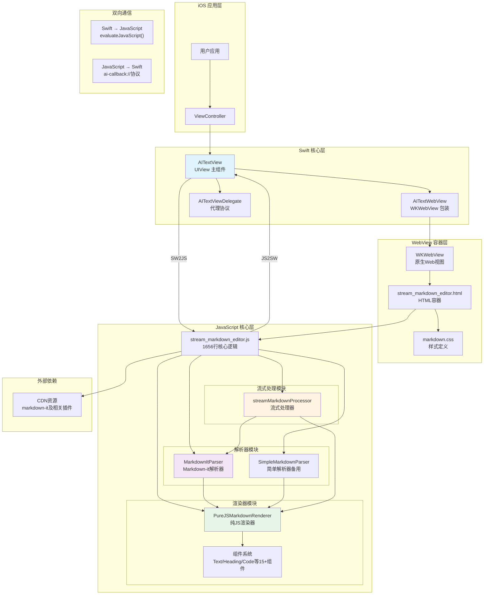

# AITextView 架构图

> 一个用于显示AI流式输出的Markdown渲染组件，采用Swift + WebView + JavaScript混合架构

## 📋 目录

- [整体架构](#-整体架构)
- [架构层次详解](#-架构层次详解)
- [数据流向](#-数据流向)
- [通信机制](#-通信机制)
- [核心组件说明](#-核心组件说明)

## 🏗️ 整体架构



## 📊 架构层次详解

### 1. **iOS 应用层**
```
用户应用 → ViewController → AITextView
```
- 用户通过 ViewController 使用 AITextView
- 支持 UIKit 和 SwiftUI 两种集成方式

### 2. **Swift 核心层**

#### **AITextView** (主组件)
- **职责**：UIView 容器，管理 WebView 生命周期
- **核心方法**：
  - `updateMarkdownStream(_:isComplete:)` - 流式更新 Markdown
  - `setMarkdown(_:)` - 设置完整 Markdown
  - `runJS(_:handler:)` - 执行 JavaScript
  - `scrollToBottom()` - 自动滚动

#### **AITextWebView** (WebView包装)
- **职责**：WKWebView 的简单包装
- **特性**：支持自定义 `inputAccessoryView`

#### **AITextViewDelegate** (代理协议)
- `aiTextViewDidLoad(_:)` - WebView 加载完成回调

### 3. **WebView 容器层**

#### **stream_markdown_editor.html**
- HTML 结构：包含 `<div id="editor">` 渲染容器
- 引入资源：
  - `markdown.css` - 样式文件
  - `stream_markdown_editor.js` - 核心逻辑

#### **markdown.css**
- Markdown 样式定义
- 支持代码块、表格、图片等样式

### 4. **JavaScript 核心层**

#### **A. 解析器模块**

**MarkdownItParser** (主解析器)
```javascript
// 使用 markdown-it 库解析
const tokens = this.md.parse(markdown, {})
return this.tokensToAST(tokens)
```
- 依赖：CDN 上的 markdown-it 库
- 支持插件：emoji、code-copy、katex、table
- 功能：将 Markdown 文本解析为 AST

**SimpleMarkdownParser** (备用解析器)
```javascript
// 使用正则表达式解析
if (line.match(/^#{1,6}\s+/)) {
  // 解析标题
}
```
- 当 markdown-it 不可用时自动启用
- 使用正则表达式实现基础解析

#### **B. 渲染器模块**

**PureJSMarkdownRenderer**
```javascript
renderAST(ast, container) {
  // 遍历 AST 节点
  // 调用对应组件渲染
}
```

**组件系统** (15+ 组件)
- `TextComponent` - 文本节点
- `ParagraphComponent` - 段落
- `HeadingComponent` - 标题 (H1-H6)
- `CodeBlockComponent` - 代码块（带复制按钮）
- `ListComponent` / `ListItemComponent` - 列表
- `BlockquoteComponent` - 引用
- `LinkComponent` / `ImageComponent` - 链接/图片
- `TableComponent` - 表格
- `StrongComponent` / `EmphasisComponent` - 粗体/斜体
- `InlineCodeComponent` - 行内代码
- `StrikethroughComponent` - 删除线
- `HorizontalRuleComponent` - 水平线

#### **C. 流式处理模块**

**streamMarkdownProcessor**
```javascript
updateMarkdown(newContent, isComplete) {
  // 1. 累积流式内容
  this.currentContent += newContent
  
  // 2. 解析为AST
  const ast = this.parser.parse(this.currentContent)
  
  // 3. 渲染到DOM（完整重新渲染）
  this.renderer.renderAST(ast, RE.editor)
  
  // 4. 自动滚动到底部
  RE.scrollToBottom()
}
```

### 5. **通信接口**

**全局 RE 对象** (提供给 Swift 调用)
```javascript
RE.setMarkdown(content)      // 设置完整内容
RE.getMarkdown()             // 获取当前内容
RE.clear()                   // 清空内容
RE.scrollToBottom()          // 滚动到底部
```

## 🔄 数据流向

### 流式渲染流程

```
┌─────────────────────────────────────────────────────┐
│ Swift 端: updateMarkdownStream()                    │
│  - 接收 AI 生成的 Markdown 片段                     │
│  - 转义 JavaScript 特殊字符                         │
└─────────────────┬───────────────────────────────────┘
                  │ evaluateJavaScript()
                  ▼
┌─────────────────────────────────────────────────────┐
│ JavaScript: RE.streamMarkdownProcessor              │
│  - updateMarkdown(newContent, isComplete)           │
│  - 累积内容到 currentContent                        │
└─────────────────┬───────────────────────────────────┘
                  │
                  ▼
┌─────────────────────────────────────────────────────┐
│ 解析阶段: MarkdownItParser.parse()                  │
│  - Markdown 文本 → markdown-it tokens               │
│  - tokens → 自定义 AST 节点树                       │
└─────────────────┬───────────────────────────────────┘
                  │
                  ▼
┌─────────────────────────────────────────────────────┐
│ 渲染阶段: PureJSMarkdownRenderer.renderAST()        │
│  - 遍历 AST 节点                                    │
│  - 调用对应 Component.render()                     │
│  - 创建 DOM 元素树                                  │
└─────────────────┬───────────────────────────────────┘
                  │
                  ▼
┌─────────────────────────────────────────────────────┐
│ DOM 更新: container.innerHTML = ''                   │
│  - 清空容器                                         │
│  - 插入新渲染的 DOM 元素                            │
│  - 触发滚动到底部                                   │
└─────────────────┬───────────────────────────────────┘
                  │
                  ▼
┌─────────────────────────────────────────────────────┐
│ 回调通知: RE.callback('streamComplete')            │
│  - 通过 ai-callback:// 协议                         │
│  - 通知 Swift 端渲染完成                            │
└─────────────────────────────────────────────────────┘
```

### 初始化流程

```
应用启动
  │
  ▼
AITextView.init()
  │
  ├─► setup()
  │     ├─► 创建 AITextWebView
  │     ├─► 设置 navigationDelegate
  │     └─► loadRichEditorView()
  │           └─► 加载 stream_markdown_editor.html
  │
  ▼
WebView 加载 HTML
  │
  ├─► 加载外部 CDN 资源（markdown-it 等）
  │
  ├─► 执行 stream_markdown_editor.js
  │     ├─► 定义组件系统
  │     ├─► 定义解析器
  │     ├─► 定义渲染器
  │     ├─► 定义流式处理器
  │     └─► waitForDependencies()
  │           └─► 检查 markdown-it 是否加载
  │                 └─► RE.init()
  │
  ▼
didFinish navigation (Swift)
  │
  └─► isEditorLoaded = true
      └─► 如果有待设置的 markdown，调用 setMarkdown()
```

## 🔌 通信机制

### Swift → JavaScript

```swift
// 方法：evaluateJavaScript()
webView.evaluateJavaScript(jsCode) { result, error in
    // 处理结果
}
```

**示例**：
```swift
let jsCode = """
window.RE.streamMarkdownProcessor.updateMarkdown('\(escapedMarkdown)', \(isComplete));
"""
runJS(jsCode)
```

### JavaScript → Swift

```javascript
// 方法：自定义 URL 协议
window.location.href = "ai-callback://"
```

**Swift 端拦截**：
```swift
func webView(_ webView: WKWebView, 
             decidePolicyFor navigationAction: WKNavigationAction,
             decisionHandler: @escaping (WKNavigationActionPolicy) -> Void) {
    
    if navigationAction.request.url?.absoluteString.hasPrefix("ai-callback://") {
        // 获取命令队列
        runJS("RE.getCommandQueue()") { commands in
            // 解析并执行命令
            self.performCommand(method)
        }
        decisionHandler(.cancel)
    }
}
```

**命令类型**：
- `ready` - JS 初始化完成
- `contentUpdate` - 内容更新
- `streamComplete` - 流式输出完成
- `contentReset` - 内容重置
- `heightChange/123` - 高度变化
- `debug/xxx` - 调试信息

## 📦 核心组件说明

### Swift 端组件

| 组件 | 文件 | 职责 |
|------|------|------|
| `AITextView` | `AITextView.swift` | 主视图组件，管理整个渲染流程 |
| `AITextWebView` | `AITextWebView.swift` | WKWebView 包装器 |
| `AITextViewDelegate` | `AITextView.swift` | 代理协议定义 |

### JavaScript 端组件

| 组件 | 位置 | 职责 |
|------|------|------|
| `PureJSMarkdownRenderer` | 391-463行 | AST → DOM 渲染器 |
| `MarkdownItParser` | 467-911行 | Markdown → AST 解析器（主） |
| `SimpleMarkdownParser` | 915-1197行 | Markdown → AST 解析器（备用） |
| `streamMarkdownProcessor` | 1251-1391行 | 流式处理核心逻辑 |
| `RE` 全局对象 | 1229-1532行 | 提供 API 给 Swift 调用 |
| 组件系统 | 11-383行 | 15+ 个组件类，负责 DOM 创建 |

### 资源文件

| 文件 | 位置 | 用途 |
|------|------|------|
| `stream_markdown_editor.html` | Resources/ | HTML 容器 |
| `stream_markdown_editor.js` | Resources/ | 核心 JavaScript 逻辑 |
| `markdown.css` | Resources/ | Markdown 样式定义 |

## 🎯 设计特点

### 1. **混合架构优势**
- ✅ 利用 Web 技术的 Markdown 渲染能力
- ✅ 保持原生 iOS 的性能和集成
- ✅ 支持复杂的 Markdown 语法（表格、代码块、数学公式等）

### 2. **流式处理设计**
- ✅ 累积内容后完整重新渲染，保证显示正确
- ✅ 自动滚动到底部，跟随新内容
- ✅ 支持增量更新和完整替换两种模式

### 3. **容错机制**
- ✅ 主解析器（markdown-it）不可用时自动降级到简单解析器
- ✅ 依赖检查超时机制，避免无限等待
- ✅ 详细的调试日志输出

### 4. **组件化渲染**
- ✅ 每个 Markdown 元素对应一个组件类
- ✅ 支持自定义样式和事件处理
- ✅ 易于扩展新的组件类型

## 📝 使用示例

### 基础使用

```swift
let aiTextView = AITextView(frame: view.bounds)
view.addSubview(aiTextView)

// 流式更新
aiTextView.updateMarkdownStream("# Hello", isComplete: false)
aiTextView.updateMarkdownStream(" World", isComplete: false)
aiTextView.updateMarkdownStream("!", isComplete: true)

// 完整设置
aiTextView.setMarkdown("# Complete Markdown Content")
```

### SwiftUI 使用

```swift
struct ContentView: View {
    var body: some View {
        AITextViewRepresentable()
            .frame(maxWidth: .infinity, maxHeight: .infinity)
    }
}

struct AITextViewRepresentable: UIViewRepresentable {
    func makeUIView(context: Context) -> AITextView {
        AITextView(frame: .zero)
    }
    
    func updateUIView(_ uiView: AITextView, context: Context) {
        // 更新视图
    }
}
```

---

## 🔗 相关文档

- [MarkdownItIntegration.md](./MarkdownItIntegration.md) - Markdown-it 集成说明
- [README.md](./AITextView/README.md) - 项目说明

---

**架构图版本**: 1.0  
**最后更新**: 2024


