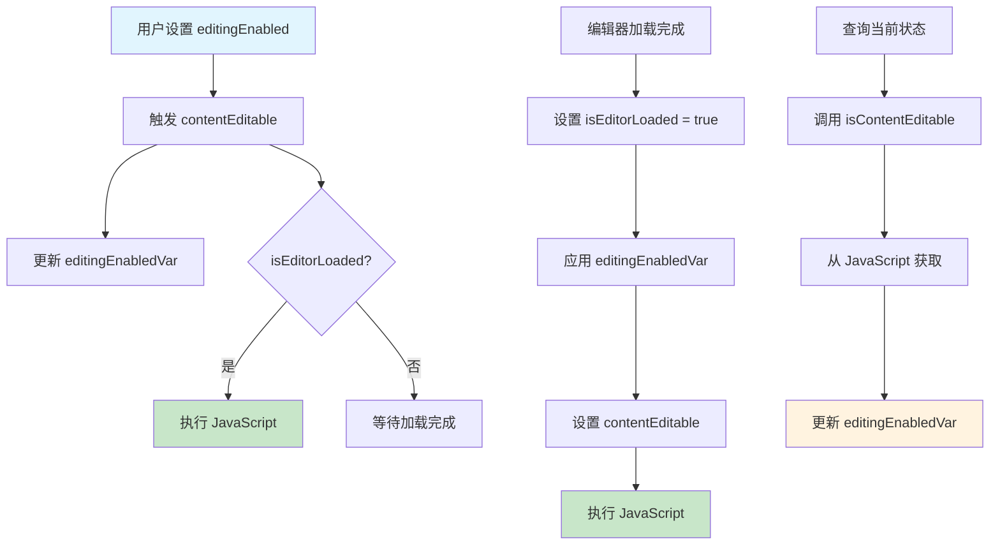

# AITextView 编辑状态设计文档

> 深入解析 AITextView 中可编辑状态标志位的设计原理和实现机制

## 📋 目录

- [概述](#-概述)
- [状态标志位详解](#-状态标志位详解)
- [状态流转机制](#-状态流转机制)
- [设计原理分析](#-设计原理分析)
- [状态关系图](#-状态关系图)
- [最佳实践](#-最佳实践)
- [常见问题](#-常见问题)

## 🎯 概述

AITextView 作为基于 WebView 的富文本编辑器，面临着异步加载、状态同步等复杂问题。为了确保编辑状态的一致性和可靠性，项目采用了**四层状态标志位**的设计模式，分别处理用户接口、内部实现、状态缓存和生命周期管理。

## 🏗️ 状态标志位详解

### 1. `editingEnabled` - 用户接口层

```swift
open var editingEnabled: Bool = false {
    didSet {
        // 将 contentEditable 设置为新值
        contentEditable = editingEnabled
    }
}
```

**职责**：
- 对外公开的编辑状态控制接口
- 用户通过此属性控制编辑器是否可编辑
- 作为外部 API 的入口点

**特点**：
- 默认值：`false`（不可编辑）
- 公开属性，供外部调用
- 设置时自动同步到内部实现层

### 2. `contentEditable` - 实现层

```swift
private var contentEditable: Bool = false {
    didSet {
        // 更新 editingEnabledVar
        editingEnabledVar = contentEditable
        // 如果编辑器已加载
        if isEditorLoaded {
            // 根据 contentEditable 的值设置 JavaScript 中的 contentEditable 属性
            let value = (contentEditable ? "true" : "false")
            runJS("RE.editor.contentEditable = \(value)")
        }
    }
}
```

**职责**：
- 内部实际控制 WebView 中 contentEditable 属性的状态
- 直接与 JavaScript 通信，设置 HTML 元素的 contentEditable 属性
- 确保状态同步到前端实现

**特点**：
- 私有属性，内部实现细节
- 设置时同步更新缓存层状态
- 只在编辑器加载完成后才执行 JavaScript

### 3. `editingEnabledVar` - 状态缓存层

```swift
private var editingEnabledVar = true
```

**职责**：
- 在编辑器加载前保存编辑状态的临时变量
- 解决编辑器异步加载时的状态同步问题
- 作为状态的中转站

**特点**：
- 默认值：`true`（可编辑）
- 私有属性，内部使用
- 在编辑器加载完成后被应用

### 4. `isEditorLoaded` - 生命周期层

```swift
private var isEditorLoaded = false
```

**职责**：
- 标记 WebView 和 JavaScript 是否已完全加载
- 控制何时可以安全地执行 JavaScript 操作
- 管理编辑器的生命周期状态

**特点**：
- 默认值：`false`（未加载）
- 在 `performCommand("ready")` 中设置为 `true`
- 控制 JavaScript 操作的执行时机

## 🔄 状态流转机制

### 初始化阶段

```swift
// 1. 创建 AITextView 时
editingEnabled = false        // 用户设置（默认不可编辑）
editingEnabledVar = true      // 内部默认值（可编辑）
isEditorLoaded = false        // 未加载
contentEditable = false       // 未设置到 JS
```

**状态说明**：
- 编辑器创建时，所有状态都是初始值
- `editingEnabledVar` 默认为 `true`，表示编辑器加载后应该可编辑
- 此时还不能执行 JavaScript 操作

### 编辑器加载完成

```swift
// 2. 在 performCommand("ready") 中
if !isEditorLoaded {
    isEditorLoaded = true
    contentEditable = editingEnabledVar  // 使用保存的状态
    // 此时会触发 contentEditable 的 didSet，设置 JS 属性
}
```

**状态说明**：
- WebView 和 JavaScript 加载完成
- 应用之前保存的编辑状态
- 开始可以安全地执行 JavaScript 操作

### 用户改变编辑状态

```swift
// 3. 用户设置 editingEnabled
aiTextView.editingEnabled = true
// ↓ 触发 editingEnabled 的 didSet
contentEditable = true
// ↓ 触发 contentEditable 的 didSet
editingEnabledVar = true
// ↓ 如果 isEditorLoaded 为 true，执行 JS
runJS("RE.editor.contentEditable = true")
```

**状态说明**：
- 用户主动改变编辑状态
- 状态逐层传递，确保一致性
- 如果编辑器已加载，立即同步到 JavaScript

### 状态查询

```swift
// 4. 异步检查当前实际状态
private func isContentEditable(handler: @escaping (Bool) -> Void) {
    if isEditorLoaded {
        runJS("RE.editor.isContentEditable") { value in
            self.editingEnabledVar = Bool(value) ?? false
        }
    }
}
```

**状态说明**：
- 从 JavaScript 查询实际状态
- 同步回 Swift 端的状态缓存
- 确保两端状态一致

## 🎯 设计原理分析

### 1. 解决异步加载问题

**问题场景**：
```swift
let editor = AITextView()
editor.editingEnabled = true  // 此时 WebView 还没加载完成
// 如果直接设置到 JavaScript，会失败
```

**解决方案**：
```swift
private var editingEnabledVar = true  // 保存用户意图
// 等编辑器加载完成后应用
if isEditorLoaded {
    contentEditable = editingEnabledVar
}
```

**优势**：
- 用户可以在任何时候设置状态
- 状态会在编辑器加载完成后自动应用
- 避免了时序问题

### 2. 分离关注点

| 标志位 | 层级 | 职责 | 可见性 |
|--------|------|------|--------|
| `editingEnabled` | 用户接口层 | 对外 API | 公开 |
| `contentEditable` | 实现层 | 控制 WebView | 私有 |
| `editingEnabledVar` | 状态缓存层 | 状态中转 | 私有 |
| `isEditorLoaded` | 生命周期层 | 控制时机 | 私有 |

**优势**：
- 每层职责清晰，便于维护
- 降低耦合度，提高可测试性
- 支持不同层级的扩展

### 3. 确保状态一致性

```swift
private var contentEditable: Bool = false {
    didSet {
        editingEnabledVar = contentEditable  // 保持同步
        if isEditorLoaded {
            runJS("RE.editor.contentEditable = \(value)")
        }
    }
}
```

**机制**：
- 状态改变时自动同步相关标志位
- 支持双向同步（Swift ↔ JavaScript）
- 避免状态不一致的问题

### 4. 支持状态查询

```swift
public func isEditingEnabled(handler: @escaping (Bool) -> Void) {
    isContentEditable(handler: handler)
}
```

**机制**：
- 支持异步查询当前实际状态
- 从 JavaScript 获取真实状态
- 同步回 Swift 端缓存

## 📊 状态关系图



## 🛠️ 最佳实践

### 1. 状态设置时机

```swift
// ✅ 推荐：在 viewDidLoad 中设置
override func viewDidLoad() {
    super.viewDidLoad()
    editor.editingEnabled = true
}

// ✅ 推荐：在编辑器加载完成后设置
func aiTextViewDidLoad(_ editor: AITextView) {
    editor.editingEnabled = true
}

// ❌ 避免：在 init 中立即设置
init() {
    editor.editingEnabled = true  // 可能不会生效
}
```

### 2. 状态查询

```swift
// ✅ 推荐：使用异步查询
editor.isEditingEnabled { isEnabled in
    print("当前编辑状态：\(isEnabled)")
}

// ❌ 避免：直接访问内部属性
// let isEnabled = editor.contentEditable  // 编译错误
```

### 3. 状态监听

```swift
// ✅ 推荐：使用代理方法监听状态变化
extension ViewController: AITextViewDelegate {
    func aiTextViewTookFocus(_ editor: AITextView) {
        // 编辑器获得焦点
    }
    
    func aiTextViewLostFocus(_ editor: AITextView) {
        // 编辑器失去焦点
    }
}
```

## ❓ 常见问题

### Q1: 为什么需要四个状态标志位？

**A**: 每个标志位都有特定的职责：
- `editingEnabled`: 用户接口
- `contentEditable`: JavaScript 控制
- `editingEnabledVar`: 状态缓存
- `isEditorLoaded`: 生命周期管理

这种设计解决了异步加载、状态同步等复杂问题。

### Q2: 为什么 `editingEnabledVar` 默认是 `true`？

**A**: 因为大多数情况下用户希望编辑器是可编辑的。如果默认是 `false`，用户需要手动设置才能编辑，这不符合常见的使用场景。

### Q3: 状态不同步怎么办？

**A**: 使用 `isEditingEnabled` 方法查询实际状态：

```swift
editor.isEditingEnabled { actualState in
    if actualState != expectedState {
        // 状态不同步，进行修正
        editor.editingEnabled = expectedState
    }
}
```

### Q4: 可以在编辑器加载前设置状态吗？

**A**: 可以。状态会被保存在 `editingEnabledVar` 中，等编辑器加载完成后自动应用。

### Q5: 如何调试状态问题？

**A**: 可以在关键位置添加日志：

```swift
private var contentEditable: Bool = false {
    didSet {
        print("contentEditable changed: \(oldValue) -> \(contentEditable)")
        editingEnabledVar = contentEditable
        if isEditorLoaded {
            print("Executing JS: RE.editor.contentEditable = \(contentEditable)")
            runJS("RE.editor.contentEditable = \(contentEditable)")
        } else {
            print("Editor not loaded yet, waiting...")
        }
    }
}
```

## 📝 总结

AITextView 的编辑状态设计体现了在复杂异步环境下的状态管理最佳实践：

1. **分层设计**：通过四层状态标志位分离关注点
2. **时序安全**：解决异步加载与状态设置的时序问题
3. **状态一致性**：确保多个标志位之间的同步
4. **向后兼容**：保持简单的对外 API

这种设计确保了编辑器的可靠性和用户体验的一致性，是值得学习和借鉴的优秀实践。

---

*本文档基于 AITextView 源码分析，如有疑问请参考源码实现。*
